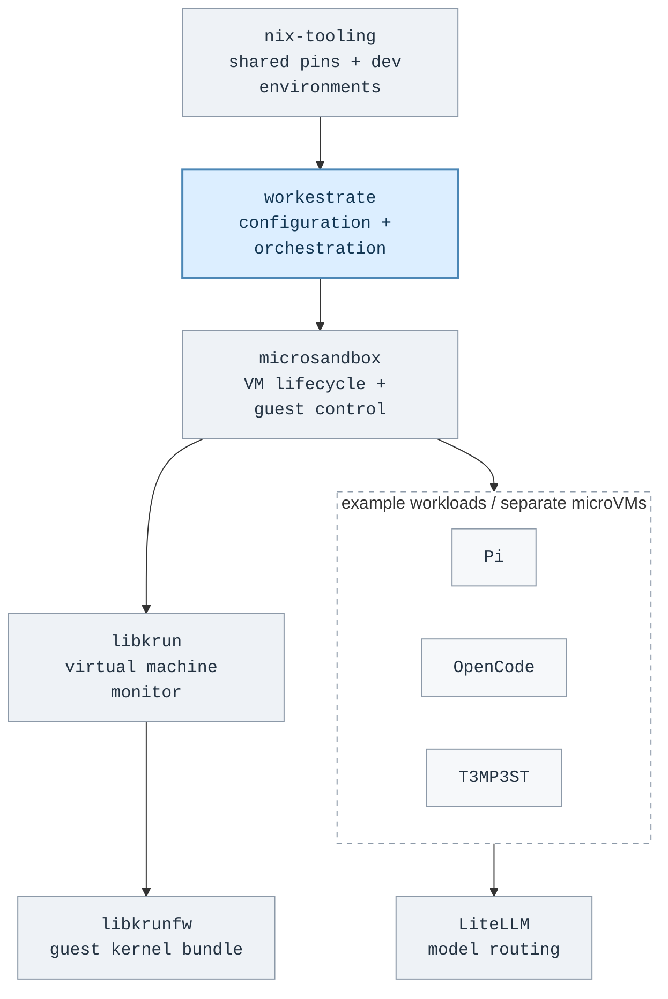

<p align="center">
  
</p>

<p align="center">
  <a href="https://github.com/rybskiworks"><kbd>rybskiworks</kbd></a>
  &nbsp;&nbsp;
  <a href="https://www.linkedin.com/in/georg-rybski"><kbd>linkedin</kbd></a>
</p>

I'm a **full-stack software engineer**. I build interfaces, APIs, and the systems underneath them, with TypeScript and Java on the product side, and Rust, Nix, and Linux in the workshop.

Part of the work at **rybskiworks** is making room for agents to explore, implement, and test freely inside deliberately scoped environments. **Fewer permission prompts, not more privilege.**

### `01 / the workshop`

A high-level map of the components I'm working with, not a deployment specification.



<p align="center">
  <a href="https://github.com/rybskiworks/workestrate/tree/migration/tool-model"><kbd>workestrate</kbd></a>
  <a href="https://github.com/rybskiworks/nix-tooling"><kbd>nix-tooling</kbd></a>
  <a href="https://github.com/rybskiworks/microsandbox"><kbd>microsandbox</kbd></a>
  <a href="https://github.com/rybskiworks/libkrun"><kbd>libkrun</kbd></a>
  <a href="https://github.com/rybskiworks/libkrunfw"><kbd>libkrunfw</kbd></a>
  <br>
  <a href="https://github.com/rybskiworks/pi"><kbd>Pi</kbd></a>
  <a href="https://github.com/rybskiworks/opencode"><kbd>OpenCode</kbd></a>
  <a href="https://github.com/rybskiworks/T3MP3ST"><kbd>T3MP3ST</kbd></a>
  <a href="https://github.com/BerriAI/litellm"><kbd>LiteLLM</kbd></a>
</p>

<sub>Several runtime and agent components are maintained forks. Workestrate and the agent forks are private; LiteLLM links to upstream. Workestrate points to the development branch. Repository links also appear outside the diagram.</sub>

### `02 / a small rule`

Choose the work. Keep the grant. A small capability filter in **jq**.

```jq
# Freedom to choose the work, not to expand the grant.
def within($grants):
  select(all(.needs[]; IN($grants[])));

["repo:read", "workspace:write", "tests:run"] as $grants
| [
    {task: "build",  needs: ["repo:read", "workspace:write"]},
    {task: "test",   needs: ["tests:run"]},
    {task: "deploy", needs: ["production:write"]}
  ]
| map(within($grants) | .task)
# => ["build", "test"]
```

<details>
<summary><samp>run it / read the intent</samp></summary>

From a clone of this profile repository, with jq installed:

```sh
jq -c -n -f examples/autonomy.jq
# ["build","test"]
```

The agent can choose from the work its existing grant permits. Building and testing fit; deploying to production does not.

This is a small policy model, not a sandbox or an authorization service. In a real system, the host enforces the boundary; the agent does not get to edit its own grant.

</details>
