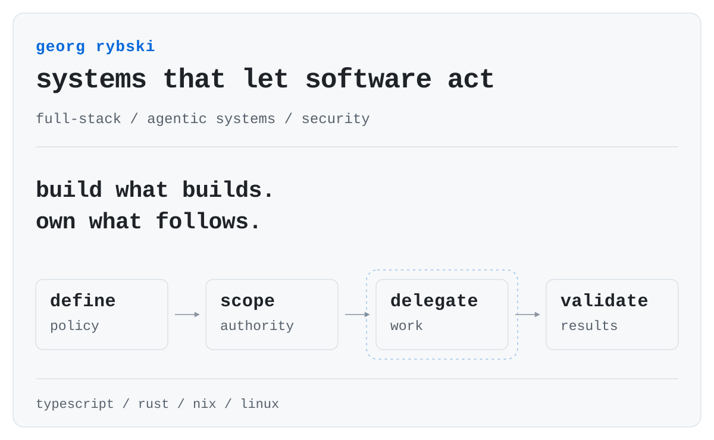

<p align="center">
  
</p>

<p align="center">
  <a href="https://github.com/rybskiworks">rybskiworks</a>
  &nbsp;·&nbsp;
  <a href="https://www.linkedin.com/in/georg-rybski">linkedin</a>
</p>

<br>

I work across software engineering and developer infrastructure, with a particular interest in systems that let autonomous software operate under explicit boundaries.

Most of what I am exploring now sits somewhere between **orchestration, virtualization, reproducible environments, security boundaries, and agentic development workflows**.

A lot of that work lives under [rybskiworks](https://github.com/rybskiworks).

<br>

<details>
<summary><samp>current coordinates</samp></summary>
<br>

```text
host        linux
systems     rust / nix
runtime     microVMs
control     policy as code
workload    humans + agents
boundary    least privilege
output      reviewed changes
```

</details>
