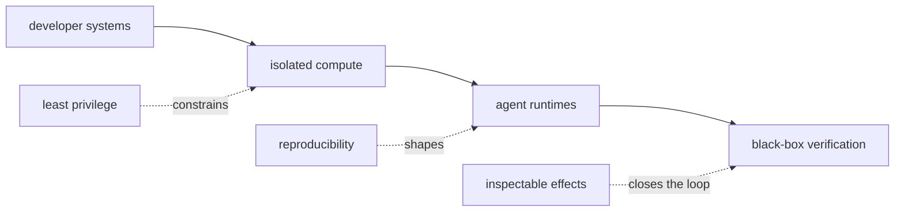

  

  <a href="https://github.com/rybskiworks"><kbd>rybskiworks</kbd></a>
  &nbsp;&nbsp;
  <a href="https://www.linkedin.com/in/georg-rybski"><kbd>linkedin</kbd></a>

### `current vector`

I work on developer infrastructure for software that can act, especially where automation meets isolation, reproducibility, policy, and verification.

| surface | current bias |
| :-- | :-- |
| **systems** | <kbd>Rust</kbd> <kbd>Nix</kbd> <kbd>Linux</kbd> |
| **runtime** | microVMs, ephemeral workloads, explicit boundaries |
| **control** | policy as code, scoped identity, least privilege |
| **evidence** | black-box tests, observable effects, reviewed diffs |

<samp>working thesis</samp>

 

Powerful software should be easy to start, difficult to escape, cheap to discard, and straightforward to inspect.

The interesting part is not only making agents more capable. It is making their authority, environment, state, and effects legible enough that capability can increase without silently expanding the blast radius.

 

<samp>Most of the current work lives at <a href="https://github.com/rybskiworks">rybskiworks</a>.</samp>
